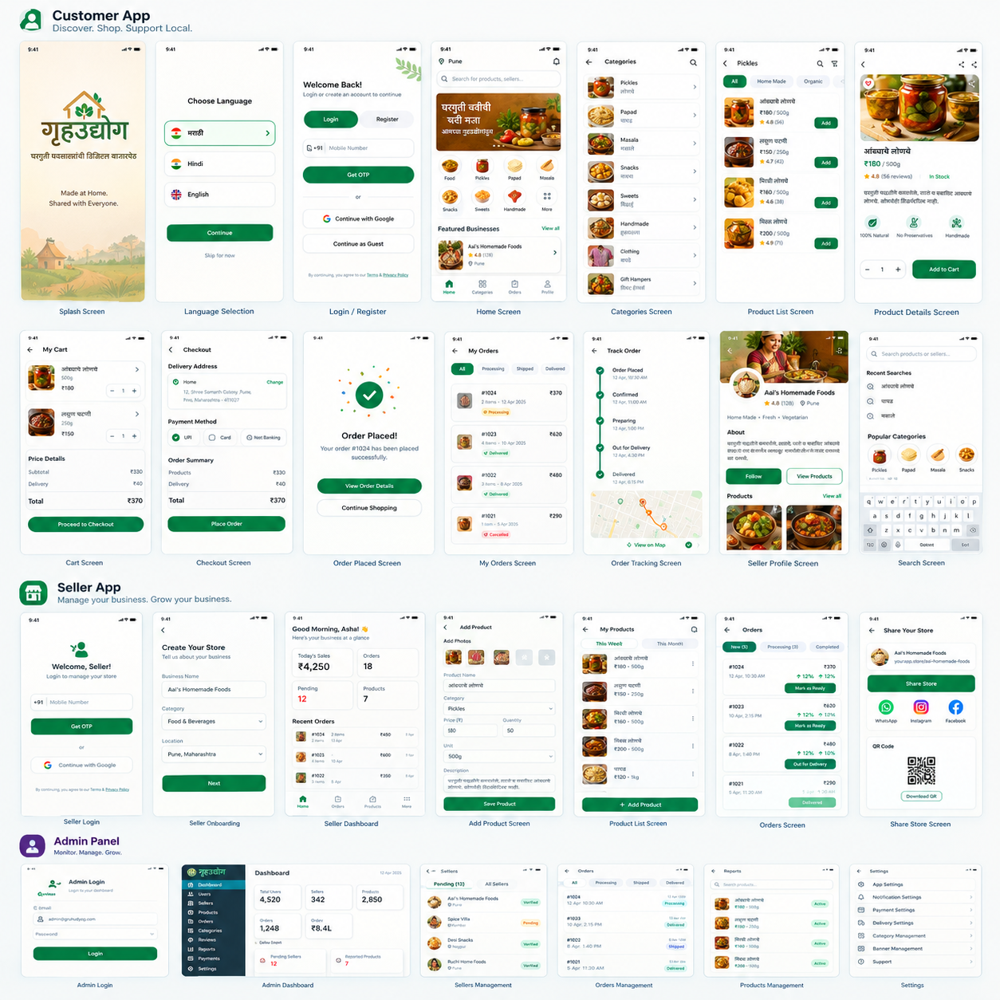

# Gruh Udyog



A scalable Flutter-based marketplace platform that helps local home-based businesses (Gruh Udyog) sell products directly to customers while giving buyers a simple and trusted shopping experience.

The product is designed around three connected experiences:

- Customer App
- Seller App
- Admin App

This repo represents the Flutter application foundation for the marketplace ecosystem.

## Overview

Gruh Udyog bridges the gap between local entrepreneurs and modern digital commerce. It enables:

- Customers to discover products from nearby home-based sellers
- Sellers to create and manage their storefronts
- Admins to monitor operations, products, and transactions
- Simple order flows from browsing to checkout to delivery tracking

## Key Features

### Customer experience
- Welcome and language selection
- Login and registration
- Product discovery by category and search
- Product listing and detail pages
- Add to cart and checkout
- Order placement and payment selection
- My orders and delivery tracking

### Seller experience
- Seller onboarding and store creation
- Product listing management
- Inventory and pricing updates
- Order management and fulfillment views
- My products, dashboard, and order tracking

### Admin experience
- Seller and product oversight
- Orders and transaction visibility
- Operational dashboard
- Settings and management screens

## App Flow

The product flow follows a modern commerce journey:

1. Splash screen and language selection
2. Login / registration
3. Home page with categories and featured products
4. Product list and product details
5. Cart and checkout
6. Order confirmation and status tracking
7. Seller and admin operations dashboards

## Screens Included

The app includes screens for:

- Splash
- Language selection
- Login / register
- Home screen
- Categories
- Product list
- Product details
- Cart
- Checkout
- My orders
- Seller dashboard
- Add product
- Order tracking
- Admin dashboard
- Settings

## Project Structure

This repository is a Flutter app project using Dart and Flutter. The application is structured around a multi-role marketplace workflow with shared UX patterns across customer, seller, and admin journeys.

## Getting Started

### Prerequisites

- Flutter SDK installed
- Android Studio / VS Code with Flutter support
- A connected device or emulator

### Run the app

```bash
flutter pub get
flutter run
```

## Development Notes

- Built with Flutter for cross-platform UI delivery
- Designed to support local commerce and community-based selling
- Structured for future backend integration, authentication, and payments

## License

This project is licensed under the MIT License. See the LICENSE file for details.
